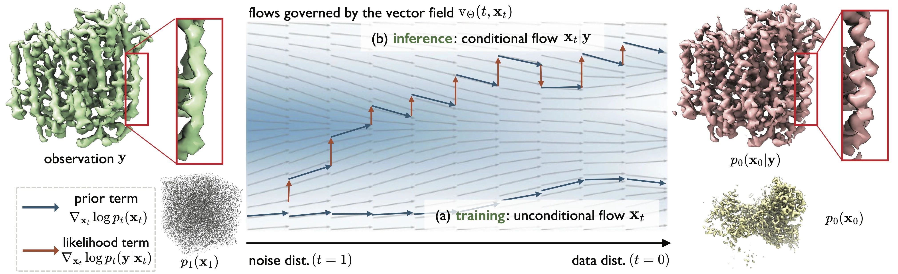

<!-- ===================== Header ===================== -->

<p align="center">
  👋 Hi, everyone!<br>
  We are <b>ByteDance Seed</b>.
</p>

<p align="center">
  
</p>

<!-- Note: The above is official Seed information. -->

<p align="center">
  AI for Science · Structural Biology
</p>

<p align="center">
  A Generative Foundation Model for Cryo-Electron Microscopy
</p>

<h1 align="center">
  CryoFM: Cryo-EM Foundation Model
</h1>

<p align="center">
  <a href="https://bytedance-seed.github.io/cryofm/">
    
  </a>
  <a href="https://bytedance-seed.github.io/cryofm/docs">
    
  </a>
  <a href="https://github.com/ByteDance-Seed/cryofm/blob/main/LICENSE">
    
  </a>
</p>

<!-- =================================================== -->

<br>
<p align="center">
  
</p>
<br>

We are extremely delighted to release **CryoFM**, a flow-based foundation model for cryo-electron microscopy (cryo-EM) density maps. CryoFM represents a significant advancement in computational structural biology, leveraging state-of-the-art generative modeling techniques to learn deep prior of 3D cryo-EM densities. This foundation model opens up new possibilities for various downstream tasks in structural biology, including density map modification, enhancement, and analysis. We hope that CryoFM will serve as a powerful tool for the scientific community and accelerate discoveries in structural biology and drug design.

## Resources

| Category | CryoFM2 | CryoFM1 |
|----------|---------|---------|
| **Papers & Reports** | <a href="https://doi.org/10.64898/2025.12.29.696802"></a> | <a href="https://arxiv.org/abs/2410.08631"></a> |
| **Model Weights** | <a href="https://huggingface.co/ByteDance-Seed/cryofm-v2"></a> | <a href="https://huggingface.co/ByteDance-Seed/cryofm-v1"></a> |
| **User Guide** | <a href="https://bytedance-seed.github.io/cryofm/docs/model-guides/cryofm2.html"></a> | <a href="https://bytedance-seed.github.io/cryofm/docs/model-guides/cryofm1/index.html"></a> |


## Getting started (For end users)

This section describes the basic usage of CryoFM for end users. CryoFM provides two model versions (CryoFM1 and CryoFM2) for various cryo-EM density map tasks.

### CryoFM2 - Density Map Modification and Enhancement

CryoFM2 is recommended for most practical applications. It supports density map denoising, inpainting, and style enhancement.

#### Denoising a density map

Remove noise from a pair of half maps:

```bash
# Single GPU
cfm denoise -i1 half_map_1.mrc -i2 half_map_2.mrc -o ./output \
    --model-dir path/to/cryofm-v2/cryofm2-pretrain \
    --op denoise --norm-grad --use-lamb-w

# Multiple GPUs
cfm denoise --num_processes 4 -i1 half_map_1.mrc -i2 half_map_2.mrc -o ./output \
    --model-dir path/to/cryofm-v2/cryofm2-pretrain \
    --op denoise --norm-grad --use-lamb-w
```

#### Density map enhancement (EMhancer style)

Apply EMhancer-style enhancement:

```bash
# Single GPU
cfm enhance -i input_map.mrc -o ./output_emhancer \
    --model-dir path/to/cryofm-v2/cryofm2-emhancer --output-tag 1

# Multiple GPUs
cfm enhance --num_processes 2 -i input_map.mrc -o ./output_emhancer \
    --model-dir path/to/cryofm-v2/cryofm2-emhancer --output-tag 1
```

#### Density map enhancement (EMReady style)

Apply EMReady-style enhancement:

```bash
# Single GPU
cfm enhance -i input_map.mrc -o ./output_emready \
    --model-dir path/to/cryofm-v2/cryofm2-emready --output-tag 0  --cfg-weight 0.5

# Multiple GPUs
cfm enhance --num_processes 2 -i input_map.mrc -o ./output_emready \
    --model-dir path/to/cryofm-v2/cryofm2-emready --output-tag 0  --cfg-weight 0.5
```

**Note:** The CLI commands automatically handle accelerate multi-GPU setup when `--num_processes` is specified. You can also use `accelerate launch` directly for more control:

```bash
accelerate launch --num_processes 4 cfm denoise -i1 half_map_1.mrc -i2 half_map_2.mrc -o ./output \
    --model-dir path/to/cryofm-v2/cryofm2-pretrain
```

For more details and advanced options, refer to the [CryoFM2 User Guide](https://bytedance-seed.github.io/cryofm/docs/model-guides/cryofm2.html).


## Getting Started (For Developers)

This section provides a quick start guide for developers who wish to pretrain, fine-tune, or test CryoFM models. Please refer to the [documentation](https://bytedance-seed.github.io/cryofm/docs/) for further details and customization.

---

### CryoFM2

#### Unconditional Generation

Generate samples from the pretrained model:

```bash
python -m cryofm.projects.cryofm2.uncond_sampling \
    -i1 half_map_1.mrc \
    -i2 half_map_2.mrc \
    -o ./output \
    --model-dir path/to/cryofm-v2/cryofm2-pretrain
```

#### Conditional Generation (Style Enhancement)

Generate enhanced density maps with different styles:

```bash
# EMhancer style
python -m cryofm.projects.cryofm2.cond_sampling \
    -i input_map.mrc \
    -o ./output \
    --model-dir path/to/cryofm-v2/cryofm2-emhancer \
    --output-tag 1

# EMReady style
python -m cryofm.projects.cryofm2.cond_sampling \
    -i input_map.mrc \
    -o ./output \
    --model-dir path/to/cryofm-v2/cryofm2-emready \
    --output-tag 0  --cfg-weight 0.5
```

For more details, see the [CryoFM2 User Guide](https://bytedance-seed.github.io/cryofm/docs/model-guides/cryofm2.html).

---

### CryoFM1

#### Testing Downstream Tasks

Run model evaluation/testing for various downstream tasks:

- **Spectral Noise Denoising**
    ```bash
    python scripts/test_cryofm1.py \
        --data-root path_to/cryofm1_1-5apix_dataset/ \
        --model-dir path_to/cryofm-v1/cryofm-s/ \
        --exp-name cryofm_sn_snr1 \
        --num-timesteps 1000 \
        --task-names spectral_noise \
        --snr-idx 1
    ```

- **Anisotropic Noise Denoising**
    ```bash
    python scripts/test_cryofm1.py \
        --data-root path_to/cryofm1_1-5apix_dataset/ \
        --model-dir path_to/cryofm-v1/cryofm-s/ \
        --exp-name cryofm_asn_snr1_tilt15 \
        --num-timesteps 1000 \
        --task-names anisotropic_spectral_noise \
        --snr-idx 1 \
        --tilt-angle 15
    ```

- **Missing Wedge Restoration**
    ```bash
    python scripts/test_cryofm1.py \
        --data-root path_to/cryofm1_1-5apix_dataset/ \
        --model-dir path_to/cryofm-v1/cryofm-s/ \
        --exp-name cryofm_mw_tilt60 \
        --num-timesteps 1000 \
        --task-names missing_wedge \
        --tilt-angle 60
    ```

Replace `path_to/cryofm-v1/cryofm-s/` with your actual model directory path. The model directory should contain `config.yaml` and `model.safetensors` files.

For more details, see the [CryoFM1 User Guide](https://bytedance-seed.github.io/cryofm/docs/model-guides/cryofm1/index.html).

---

For more details on data preparation, model customization, and advanced usage, please refer to the official documentation or contact the maintainers.

## License
This project is licensed under the Apache License 2.0. See the [LICENSE](./LICENSE) file for details.

## Citation

If you use CryoFM in your research, please cite the relevant paper(s):

**CryoFM2:**
```bibtex
@article{
Li2025.12.29.696802,
author={Li, Yilai and Yuan, Jing and Zhou, Yi and Wang, Zhenghua and Chen, Suyi and Yang, Fengyu and Ling, Haibin and Kovalsky, Shahar Z and Zheng, Xiaoqing and Gu, Quanquan},
title={A Generative Foundation Model for Cryo-EM Densities},
elocation-id={2025.12.29.696802},
year={2025},
doi={10.64898/2025.12.29.696802},
publisher={Cold Spring Harbor Laboratory},
URL={https://www.biorxiv.org/content/early/2025/12/29/2025.12.29.696802},
eprint={https://www.biorxiv.org/content/early/2025/12/29/2025.12.29.696802.full.pdf},
journal={bioRxiv}
}
```

**CryoFM1:**
```bibtex
@inproceedings{
zhou2025cryofm,
title={Cryo{FM}: A Flow-based Foundation Model for Cryo-{EM} Densities},
author={Yi Zhou and Yilai Li and Jing Yuan and Quanquan Gu},
booktitle={The Thirteenth International Conference on Learning Representations},
year={2025},
url={https://openreview.net/forum?id=T4sMzjy7fO}
}
```

## About [ByteDance Seed Team](https://seed.bytedance.com/)

Founded in 2023, ByteDance Seed Team is dedicated to crafting the industry's most advanced AI foundation models. The team aspires to become a world-class research team and make significant contributions to the advancement of science and society. You can get to know Bytedance Seed better through the following channels👇
<div>
  <a href="https://seed.bytedance.com/">
    </a>
  <a href="https://github.com/user-attachments/assets/5793e67c-79bb-4a59-811a-fcc7ed510bd4">
    </a>
 <a href="https://www.xiaohongshu.com/user/profile/668e7e15000000000303157d">
    </a>
  <a href="https://www.zhihu.com/org/dou-bao-da-mo-xing-tuan-dui/">
    </a>
</div>
