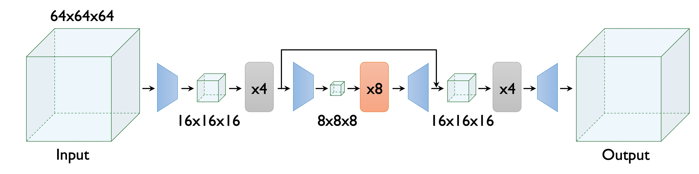
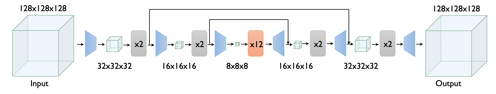

# CryoFM1: Overview

> **CryoFM: A Flow-based Foundation Model for Cryo-EM Densities**  
> *The Thirteenth International Conference on Learning Representations (ICLR)*, 2025.

## What is cryoFM?

<figure markdown>
  <video src="https://lf3-nlp-opensource.bytetos.com/obj/nlp-opensource/cryofm/videos/cryofm.mp4" controls autoplay loop muted playsinline style="width: 100%; max-width: 800px;"></video>
  <figcaption>CryoFM can solve inverse problems without fine-tuning.</figcaption>
</figure>

CryoFM is the **first 3D density map foundation model** in the cryo-EM field. It is a base model pretrained on high-resolution density maps using a Hierarchical Diffusion Transformer (HDiT) architecture. Through posterior sampling, cryoFM can be applied to **various cryo-EM downstream inverse problems without fine-tuning**. We have open-sourced implementations for denoising, anisotropy denoising, and missing wedge in-painting.

CryoFM1 is available in two variants:

- **CryoFM-S**: A smaller model optimized for 64×64×64 voxel volumes at 1.5 Å/pixel resolution
<figure markdown>
  
  <figcaption>CryoFM-S architecture.</figcaption>
</figure>

- **CryoFM-L**: A larger model designed for 128×128×128 voxel volumes at 3.0 Å/pixel resolution
<figure markdown>
  
  <figcaption>CryoFM-L architecture.</figcaption>
</figure>

## Get Started

- [Sampling](sampling.md): Learn how to generate density maps using CryoFM1.
- [Downstream Tasks](downstream-tasks.md): Explore denoising, anisotropy denoising, and missing wedge in-painting.

## Resources

- **Model Weights**: Available on [Hugging Face](https://huggingface.co/ByteDance-Seed/cryofm-v1).
- **Source Code**: Available on [GitHub](https://github.com/ByteDance-Seed/cryofm).
- **Dataset (EMDB ID Lists)**: Available on [Zenodo](https://zenodo.org/records/18013604).

## Citation

If you use CryoFM1 in your research, please cite:

```bibtex
@inproceedings{
zhou2025cryofm,
title={Cryo{FM}: A Flow-based Foundation Model for Cryo-{EM} Densities},
author={Yi Zhou and Yilai Li and Jing Yuan and Quanquan Gu},
booktitle={The Thirteenth International Conference on Learning Representations},
year={2025},
url={https://openreview.net/forum?id=T4sMzjy7fO}
}
```

