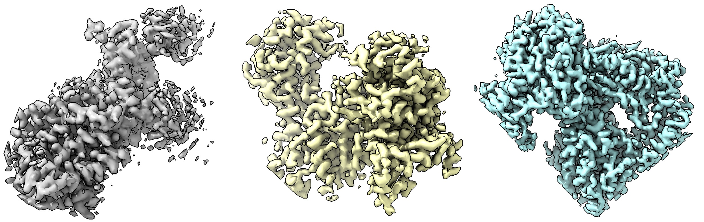
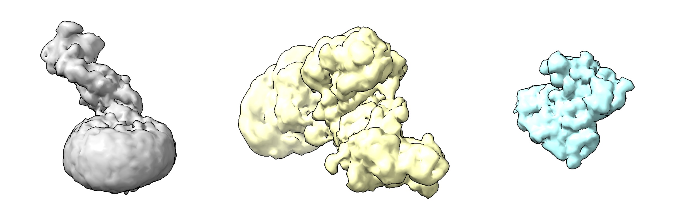

# CryoFM1: Sampling

## Prerequisites

Before using CryoFM1, ensure you have:

#### 1. Install CryoFM with compatible dependencies

CryoFM1 uses the HDiT model architecture, which depends on the `natten` package. Different versions of `natten` have varying requirements for PyTorch and CUDA versions. For a reproducible installation, follow these steps:

```bash
# natten 0.17.5 uses type union syntax, you must use python >=3.10
conda create -n cryofm python=3.10 -y
conda activate cryofm

# Install PyTorch 2.5.1 with CUDA 12.4 support
pip install torch==2.5.1 torchvision==0.20.1 --index-url https://download.pytorch.org/whl/cu124

# Install natten 0.17.5 compatible with PyTorch 2.5.0 and CUDA 12.4
pip install natten==0.17.5+torch250cu124 -f https://whl.natten.org

# Clone and install CryoFM
git clone https://github.com/ByteDance-Seed/cryofm
cd cryofm
pip install .
```

#### 2. Download model checkpoints and configuration files

CryoFM1 model weights and configuration files are available for download from the [Hugging Face repository](https://huggingface.co/ByteDance-Seed/cryofm-v1). To download the model weights, first install the Hugging Face CLI tool:
```bash
pip install huggingface-hub
```
Then download all model files using:
```bash
hf download ByteDance-Seed/cryofm-v1 --local-dir ./cryofm-v1
```
This will download all necessary model files (including `cryofm-s` and `cryofm-l`) to the `./cryofm-v1` directory. You can change `./cryofm-v1` to your preferred download location.

---

## Basic Usage

### CryoFM-S: Unconditional Generation

CryoFM-S generates 64×64×64 voxel density maps at 1.5 Å/pixel resolution. Example outputs are shown below:

<figure markdown>
  
  <figcaption>CryoFM-S sampling examples at 1.5 Å/pixel resolution.</figcaption>
</figure>

```python
import torch
from mmengine import Config
from cryofm.core.utils.mrc_io import save_mrc
from cryofm.projects.cryofm1.lit_modules import CryoFM1
from cryofm.core.utils.sampling_fm import sample_from_fm

# Load configuration and model
cfg = Config.fromfile("path_to/cryofm-v1/cryofm-s/config.yaml")
lit_model = CryoFM1.load_from_safetensors(
    "path_to/cryofm-v1/cryofm-s/model.safetensors", 
    cfg=cfg
)

# Set up device and model
device = torch.device("cuda" if torch.cuda.is_available() else "cpu")
lit_model = lit_model.to(device)
lit_model.eval()

# Define vector field function for flow matching
def v_xt_t(_xt, _t):
    return lit_model(_xt, _t)

# Generate samples
# Note: Enable bfloat16 if your GPU supports it for better performance
with torch.no_grad(), torch.autocast("cuda", dtype=torch.bfloat16):
    out = sample_from_fm(
        v_xt_t, 
        lit_model.noise_scheduler, 
        method="euler", 
        num_steps=200, 
        num_samples=3, 
        device=device, 
        side_shape=64
    )
    # Apply z-scaling normalization if configured
    if hasattr(lit_model.cfg, "z_scale") and lit_model.cfg.z_scale.mean is not None:
        out = out * lit_model.cfg.z_scale.std + lit_model.cfg.z_scale.mean

# Save generated density maps
for i in range(3):
    save_mrc(
        out[i].float().cpu().numpy(), 
        f"sample-{i}.mrc", 
        apix=1.5  # Angstroms per pixel
    )
```

---

### CryoFM-L: Unconditional Generation

CryoFM-L generates 128×128×128 voxel density maps at 3.0 Å/pixel resolution. Example outputs are shown below:

<figure markdown>
  
  <figcaption>CryoFM-L sampling examples at 3.0 Å/pixel resolution.</figcaption>
</figure>

```python
import torch
from mmengine import Config
from cryofm.core.utils.mrc_io import save_mrc
from cryofm.projects.cryofm1.lit_modules import CryoFM1
from cryofm.core.utils.sampling_fm import sample_from_fm

# Load configuration and model
cfg = Config.fromfile("path_to/cryofm-v1/cryofm-l/config.yaml")
lit_model = CryoFM1.load_from_safetensors(
    "path_to/cryofm-v1/cryofm-l/model.safetensors", 
    cfg=cfg
)

# Set up device and model
device = torch.device("cuda" if torch.cuda.is_available() else "cpu")
lit_model = lit_model.to(device)
lit_model.eval()

# Define vector field function for flow matching
def v_xt_t(_xt, _t):
    return lit_model(_xt, _t)

# Generate samples
# Note: Enable bfloat16 if your GPU supports it for better performance
with torch.no_grad(), torch.autocast("cuda", dtype=torch.bfloat16):
    out = sample_from_fm(
        v_xt_t, 
        lit_model.noise_scheduler, 
        method="euler", 
        num_steps=200, 
        num_samples=3, 
        device=device, 
        side_shape=128
    )
    # Apply z-scaling normalization if configured
    if hasattr(lit_model.cfg, "z_scale") and lit_model.cfg.z_scale.mean is not None:
        out = out * lit_model.cfg.z_scale.std + lit_model.cfg.z_scale.mean

# Save generated density maps
for i in range(3):
    save_mrc(
        out[i].float().cpu().numpy(), 
        f"sample-{i}.mrc", 
        apix=3.0  # Angstroms per pixel
    )
```

---

## Advanced Usage

### Sampling Methods

The `sample_from_fm` function supports multiple ODE solvers for the flow matching process:

- **`"euler"`**: Euler method (default, fastest)
- **`"rk4"`**: 4th-order Runge-Kutta method (more accurate, slower)
- **`"midpoint"`**: Midpoint method (balanced)
- **`"heun"`**: Heun's method
- **`"ralston"`**: Ralston's method

For most use cases, `"euler"` with 200 steps provides a good balance between quality and speed. For higher quality, consider using `"rk4"` or increasing `num_steps`.

### Adjusting Sampling Parameters

- **`num_steps`**: Number of integration steps (default: 200). More steps generally yield better quality but take longer.
- **`num_samples`**: Number of samples to generate in a single batch.
- **`side_shape`**: Spatial dimensions of the output volume (64 for CryoFM-S, 128 for CryoFM-L).

