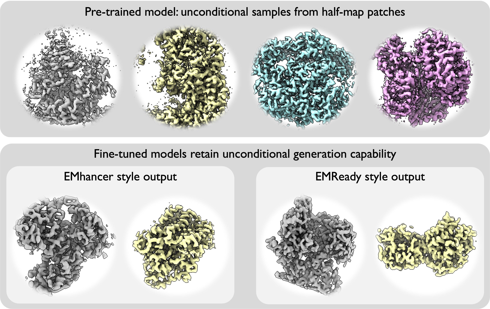

# CryoFM2 User Guide

> **A Generative Foundation Model for Cryo-EM Densities**  
> *under review*, 2025.

## Overview

CryoFM2 is a flow-based foundation model designed for generating and working with 3D cryo-electron microscopy (cryo-EM) density maps. The model employs a UNet architecture.
CryoFM2 is pretrained on curated EMDB half maps to learn general priors of high-quality cryo-EM densities and can be fine-tuned for downstream tasks. The model learns a continuous mapping from a simple Gaussian distribution to the complex distribution of cryo-EM densities, enabling stable generation and flexible adaptation. CryoFM2 can also act as a **Bayesian prior**, integrating naturally with task-specific likelihoods to support applications such as anisotropy-aware refinement, non-uniform reconstruction, and controlled density modification.

### Model Variants

CryoFM2 is available in three variants:

1. **cryofm2-pretrain**: Unconditional pretrained model for general density map generation and modification tasks
2. **cryofm2-emhancer**: Fine-tuned model for density map enhancement (EMhancer style)
3. **cryofm2-emready**: Fine-tuned model for density map enhancement (EMReady style)

## Prerequisites

Before using CryoFM2, ensure you have:

- The `cryofm` package installed (see [Installation Guide](../getting-started/installation.md))
- Model checkpoints and configuration files downloaded from the Hugging Face repository
- PyTorch with CUDA support (recommended for GPU acceleration)

## Basic Usage

### Unconditional Generation
> Exploring Training Data Distribution

Generate samples from the pretrained model to explore the learned data distribution. This is useful for understanding what the model has learned and for generating synthetic density maps.

<figure markdown>
  
  <figcaption>CryoFM2 unconditional samples.</figcaption>
</figure>

#### Pretrained Model

```python
import torch
from mmengine import Config

from cryofm.core.utils.mrc_io import save_mrc
from cryofm.core.utils.sampling_fm import sample_from_fm
from cryofm.projects.cryofm2.lit_modules import CryoFM2Uncond

# Load configuration and model
# Update the path to your model directory
model_dir = "path/to/cryofm-v2/cryofm2-pretrain"
cfg = Config.fromfile(f"{model_dir}/config.yaml")
lit_model = CryoFM2Uncond.load_from_safetensors(
    f"{model_dir}/model.safetensors", 
    cfg=cfg
)

# Set up device and model
device = torch.device("cuda" if torch.cuda.is_available() else "cpu")
lit_model = lit_model.to(device)
lit_model.eval()

# Define vector field function for flow matching
def v_xt_t(_xt, _t):
    return lit_model(_xt, _t)

# Generate samples
# Note: Enable bfloat16 if your GPU supports it for better performance
with torch.no_grad(), torch.autocast("cuda", dtype=torch.bfloat16):
    out = sample_from_fm(
        v_xt_t, 
        lit_model.noise_scheduler, 
        method="euler", 
        num_steps=200, 
        num_samples=3, 
        device=lit_model.device, 
        side_shape=64
    )

# Save generated density maps
for i in range(3):
    save_mrc(
        out[i].float().cpu().numpy(), 
        f"sample-{i}.mrc", 
        apix=1.5  # Angstroms per pixel
    )
```

#### Fine-tuned Models (EMhancer/EMReady)

Fine-tuned models can also generate unconditional samples in their respective styles:

```python
import torch
from mmengine import Config

from cryofm.core.utils.mrc_io import save_mrc
from cryofm.core.utils.sampling_fm import sample_from_fm
from cryofm.projects.cryofm2.lit_modules import CryoFM2Cond

# Choose style: "emhancer" or "emready"
style = "emhancer"
model_dir = f"path/to/cryofm-v2/cryofm2-{style}"
cfg = Config.fromfile(f"{model_dir}/config.yaml")
lit_model = CryoFM2Cond.load_from_safetensors(
    f"{model_dir}/model.safetensors", 
    cfg=cfg
)
output_tag = 1 if style == "emhancer" else 0

# Set up device and model
device = torch.device("cuda" if torch.cuda.is_available() else "cpu")
lit_model = lit_model.to(device)
lit_model.eval()

# Define vector field function with conditional generation
def v_xt_t(_xt, _t):
    bs = _xt.shape[0]
    unconditional_generation_conds = {
        "input_cond": None,
        "output_cond": torch.tensor([output_tag] * bs).to(device),
        "vol_cond": None,  # dimension should be [bs, d, h, w]
    }
    return lit_model(_xt, _t, generation_conds=unconditional_generation_conds)

# Generate samples
# Note: Enable bfloat16 if your GPU supports it for better performance
with torch.no_grad(), torch.autocast("cuda", dtype=torch.bfloat16):
    out = sample_from_fm(
        v_xt_t, 
        lit_model.noise_scheduler, 
        method="euler", 
        num_steps=200, 
        num_samples=3, 
        device=lit_model.device, 
        side_shape=64
    )

# Save generated density maps
for i in range(3):
    save_mrc(
        out[i].float().cpu().numpy(), 
        f"{style}-sample-{i}.mrc", 
        apix=1.5  # Angstroms per pixel
    )
```

## Advanced Usage

### Density Map Modification

CryoFM2 supports various density map modification operations using the pretrained model as a Bayesian prior. The model integrates with task-specific likelihoods through Diffusion Posterior Sampling (DPS) to perform restoration tasks.

#### Supported Operators

- **`denoise`**: Remove noise from density maps
- **`inpaint`**: Fill missing regions
- **`denoise inpaint`**: Combined denoising and inpainting
- **`non-uniform`**: Apply non-uniform weighting during reconstruction

#### Basic Denoising

Remove noise from a pair of half maps:

```bash
python -m cryofm.projects.cryofm2.uncond_sampling \
    -i1 half_map_1.mrc \
    -i2 half_map_2.mrc \
    -o ./output \
    --model-dir path/to/cryofm-v2/cryofm2-pretrain \
    --op denoise \
    --norm-grad \
    --use-lamb-w
```

**Key Parameters:**

- `-i1`, `-i2`: Input half map files (MRC format)
- `-o`: Output directory for processed maps
- `--model-dir`: Path to the model directory containing `config.yaml` and `model.safetensors`
- `--op`: Forward operator type (see supported operators above)
- `--norm-grad`: Use normalized gradient for likelihood guidance (recommended)
- `--use-lamb-w`: Use decayed lambda scheduler for better convergence

#### Missing Wedge Inpainting

For inpainting tasks, you need to provide a RELION starfile (with pose) path to compute the Fourier mask:

```bash
python -m cryofm.projects.cryofm2.uncond_sampling \
    -i1 half_map_1.mrc \
    -i2 half_map_2.mrc \
    -o ./output \
    --model-dir path/to/cryofm-v2/cryofm2-pretrain \
    --op inpaint \
    --data-starfile-path path/to/relion_data.star \
    --norm-grad \
    --use-lamb-w
```

**Additional Parameters for Inpainting:**

- `--data-starfile-path`: Path to RELION starfile containing particle metadata
- `--fmask-threshold`: Threshold for Fourier mask (default: 1.0)

#### Combined Denoising and Inpainting

Perform both denoising and inpainting simultaneously:

```bash
python -m cryofm.projects.cryofm2.uncond_sampling \
    -i1 half_map_1.mrc \
    -i2 half_map_2.mrc \
    -o ./output \
    --model-dir path/to/cryofm-v2/cryofm2-pretrain \
    --op denoise inpaint \
    --data-starfile-path path/to/relion_data.star \
    --norm-grad \
    --use-lamb-w
```

### Density Map Post-Processing

CryoFM2 provides fine-tuned models for density map enhancement in different styles, similar to EMhancer and EMReady. These models can improve the visual quality and interpretability of cryo-EM density maps.

#### EMhancer Style Enhancement

Apply EMhancer-style enhancement to a density map:

```bash
python -m cryofm.projects.cryofm2.cond_sampling \
    -i input_map.mrc \
    -o ./output_emhancer \
    --model-dir path/to/cryofm-v2/cryofm2-emhancer \
    --output-tag 1
```

#### EMReady Style Enhancement

Apply EMReady-style enhancement to a density map:

```bash
python -m cryofm.projects.cryofm2.cond_sampling \
    -i input_map.mrc \
    -o ./output_emready \
    --model-dir path/to/cryofm-v2/cryofm2-emready \
    --output-tag 0 \
    --cfg-weight 0.5
```

**Parameters:**

- `-i`: Input density map file (MRC format)
- `-o`: Output directory
- `--model-dir`: Path to the model directory containing `config.yaml` and `model.safetensors`
- `--output-tag`: Style tag (1 for EMhancer, 0 for EMReady)
- `--cfg-weight`: Classifier-free guidance weight (optional, default varies by model).

#### Operator Control for Processing Models

The fine-tuned processing models (EMhancer/EMReady) also support different operators for controlled density map modification. You can combine style enhancement with operators such as denoising and inpainting:

**Denoising with EMhancer style:**

```bash
python -m cryofm.projects.cryofm2.cond_sampling \
    -i1 half_map_1.mrc \
    -i2 half_map_2.mrc \
    -o ./output_emhancer \
    --model-dir path/to/cryofm-v2/cryofm2-emhancer \
    --output-tag 1 \
    --op denoise \
    --norm-grad \
    --use-lamb-w
```

**Supported operators for processing models:**

- `denoise`: Apply denoising while maintaining the enhancement style
- `denoise inpaint`: Combined denoising and inpainting with style enhancement
- `non-uniform`: Apply non-uniform weighting during reconstruction

**Note:** When using operators with processing models, the model performs posterior sampling to integrate the operator constraints with the style enhancement, providing both task-specific restoration and visual enhancement.

## Performance Optimization

### Multi-GPU Inference

Use `accelerate launch` for faster inference on multiple GPUs:

```bash
NCCL_DEBUG=ERROR accelerate launch \
    --num_processes=${NUM_GPUS} \
    --main_process_port=8881 \
    python -m cryofm.projects.cryofm2.cond_sampling \
        -i input_map.mrc \
        -o ./output \
        --model-dir path/to/cryofm-v2/cryofm2-emhancer \
        --output-tag 1
```

Replace `${NUM_GPUS}` with the actual number of GPUs you want to use.

### Mixed Precision Inference

Use `--bf16` flag when available to reduce memory usage and speed up inference:

```bash
python -m cryofm.projects.cryofm2.cond_sampling \
    -i input_map.mrc \
    -o ./output \
    --model-dir path/to/cryofm-v2/cryofm2-emhancer \
    --output-tag 1 \
    --bf16
```

**Note:** This requires GPU support for bfloat16 (e.g., NVIDIA A100, H100, or newer GPUs).

### Batch Processing

For processing multiple maps, you can adjust batch size based on your GPU memory capacity:

```bash
python -m cryofm.projects.cryofm2.uncond_sampling \
    -i1 half_map_1.mrc \
    -i2 half_map_2.mrc \
    -o ./output \
    --model-dir path/to/cryofm-v2/cryofm2-pretrain \
    --op denoise \
    --batch-size 8 \
    --bf16
```
