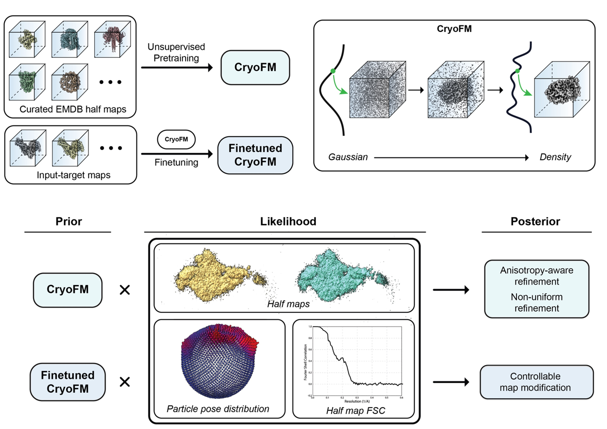

# CryoFM2: Overview

> **A Generative Foundation Model for Cryo-EM Densities**  
> *under review*, 2025.

## What is CryoFM2?

<figure markdown>
  
  <figcaption>CryoFM2 overview.</figcaption>
</figure>

Single-particle cryo-EM density reconstruction is a severely ill-posed inverse problem, commonly degraded by noise, preferred orientations, and reconstruction artifacts. Existing approaches either rely on strong hand-crafted assumptions or supervised post-processing models.

CryoFM2 addresses this challenge by introducing a generative foundation model for cryo-EM densities. The model is trained unsupervised on thousands of high-quality cryo-EM maps using flow matching, learning a reusable prior over macromolecular density distributions that generalizes across molecular systems. The model employs a UNet architecture and is pretrained on curated EMDB half maps.

At inference time, this learned prior is combined with explicit likelihood models that describe experimental degradations, forming a principled Bayesian inference framework. Within this framework, CryoFM2 performs flow-based posterior sampling (FPS), an inference-only procedure that simultaneously enables denoising, restoration, and refinement while remaining explicitly constrained by dataset-derived statistics. This approach supports applications such as:

- Anisotropy-aware refinement
- Non-uniform reconstruction
- Controlled density modification
- Density map enhancement

---

## Model Variants

CryoFM2 is available in three variants:

1. **cryofm2-pretrain**: Unconditional pretrained model for general density map generation and modification tasks.
2. **cryofm2-emhancer**: Fine-tuned model for density map enhancement (EMhancer style).
3. **cryofm2-emready**: Fine-tuned model for density map enhancement (EMReady style).

---

## Get Started

### For End Users

- [Quick Start](quick-start.md): Learn how to use CryoFM2 for common tasks like denoising and style enhancement using simple command-line tools.

### Understanding Operators

- [Operators](operators.md): Explore the different forward operators available in CryoFM2, including denoising, inpainting, and non-uniform refinement.

### For Developers

- [Unconditional Sampling](unconditional-sampling.md): Learn how to use the Python API to generate unconditional samples from CryoFM2 models.
- [Likelihood Control](likelihood-control.md): Understand how to use scripts for likelihood control (FPS) and fine-tune parameters for different tasks.

---

## Resources

- **Model Weights**: Available on [Hugging Face](https://huggingface.co/ByteDance-Seed/cryofm-v2).
- **Source Code**: Available on [GitHub](https://github.com/ByteDance-Seed/cryofm).
- **Dataset (EMDB ID Lists)**: Available on [Zenodo](https://zenodo.org/records/18013604).

---

## Citation

If you use CryoFM2 in your research, please cite:

```bibtex
@article{
Li2025.12.29.696802,
author={Li, Yilai and Yuan, Jing and Zhou, Yi and Wang, Zhenghua and Chen, Suyi and Yang, Fengyu and Ling, Haibin and Kovalsky, Shahar Z and Zheng, Xiaoqing and Gu, Quanquan},
title={A Generative Foundation Model for Cryo-EM Densities},
elocation-id={2025.12.29.696802},
year={2025},
doi={10.64898/2025.12.29.696802},
publisher={Cold Spring Harbor Laboratory},
URL={https://www.biorxiv.org/content/early/2025/12/29/2025.12.29.696802},
eprint={https://www.biorxiv.org/content/early/2025/12/29/2025.12.29.696802.full.pdf},
journal={bioRxiv}
}
```
