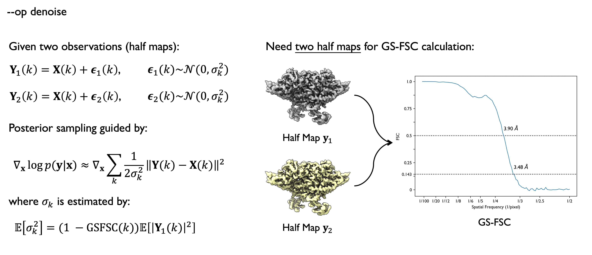
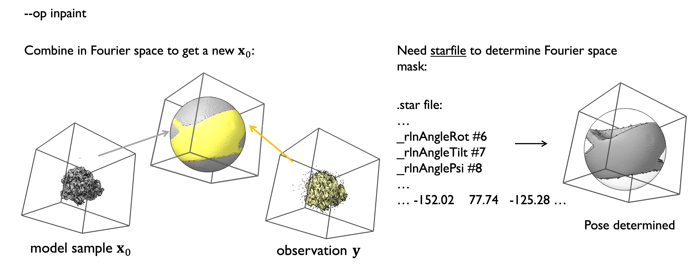
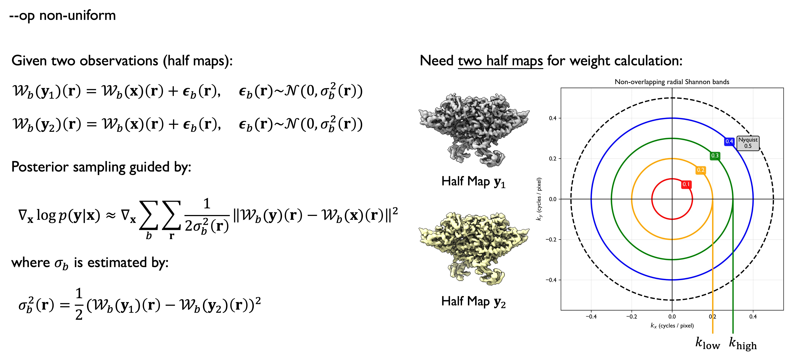

# CryoFM2: Intro to Different Operators

CryoFM2 addresses general inverse problems of the form $\mathbf{y} = \mathcal{A}\mathbf{x} + \mathbf{\epsilon}$, where we aim to recover the clean signal $\mathbf{x}$ from the observed data $\mathbf{y}$. Here, $\mathcal{A}$ represents the forward operator, and $\epsilon$ denotes the noise term. While some of the operations described below are not strictly operators in the mathematical sense, we adopt the term "operator" for consistency. Throughout this document, we use uppercase letters to denote Fourier-transformed quantities, e.g., $\mathbf{Y} = \mathcal{F}\mathbf{y}$ where $\mathcal{F}$ represents the Fourier transform operator.

CryoFM2 supports multiple forward operators through the Flow-based Posterior Sampling (FPS) framework. These operators integrate with the learned prior distribution to enable different density map processing tasks. This document introduces three main operator types: **denoise**, **inpaint**, and **non-uniform**.

## Denoise

The `denoise` operator removes noise from cryo-EM density maps to improve signal-to-noise ratio and resolution. It leverages FSC (Fourier Shell Correlation) information between two half maps to estimate noise power and combines the model prior with observed data through the DPS method.

<figure markdown>
  
  <figcaption>What is `denoise` operator.</figcaption>
</figure>

### How It Works

1. **Noise Estimation**: Computes FSC curves from two half maps to estimate noise power at different frequencies
2. **Likelihood Modeling**: Calculates weighted loss in Fourier space based on FSC and signal power
3. **Posterior Sampling**: Uses gradient guidance to denoise while maintaining data consistency and leveraging the model prior 

---

## Inpaint

The `inpaint` operator fills missing regions in density maps, particularly useful for addressing missing wedge problems in cryo-EM reconstructions. This operator works in Fourier space and computes missing region masks by providing a RELION starfile.

<figure markdown>
  
  <figcaption>What is `inpaint` operator.</figcaption>
</figure>

### How It Works

1. **Mask Computation**: Extracts particle pose information from RELION starfile to compute missing region masks in Fourier space
2. **Constraint Guidance**: Uses observed data in missing regions and leverages model prior for filling
3. **Consistency Guarantee**: Ensures the inpainted density map remains consistent with observed data in known regions

### Combined Usage

The `denoise` and `inpaint` operators can be used simultaneously (`denoise inpaint`) to perform both denoising and inpainting operations, suitable for density maps with anisotropy effect.

---

## Non-uniform

The `non-uniform` operator performs density map reconstruction with non-uniform weighting, suitable for processing cryo-EM data with spatially varying noise or anisotropic characteristics. This operator works in the wavelet domain and adjusts weights for different regions based on local variance.

<figure markdown>
  
  <figcaption>What is `non-uniform` operator.</figcaption>
</figure>

### How It Works

1. **Wavelet Transform**: Converts density maps to wavelet domain, decomposing into multiple frequency bands
2. **Variance Estimation**: Computes spatially varying variance (`wt_sigma2`) for each wavelet band
3. **Weighted Optimization**: Calculates weights based on local variance, giving higher weights to regions with lower variance
4. **Posterior Sampling**: Performs gradient-guided optimization in real domain to achieve non-uniform denoising
